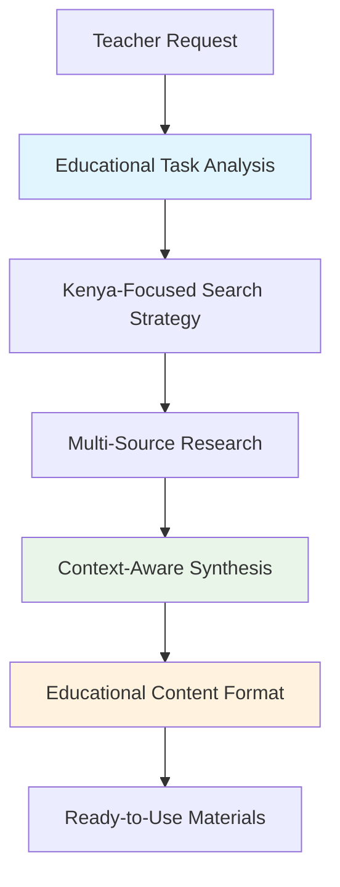

# Elimu Research Assistant

**A Tool for Localized Educational Content Creation in Kenya**

*Elimu* (Swahili for "education") Research Assistant is an intelligent AI tool designed specifically for Kenyan educators to bridge the context deficit in education by generating locally relevant, credibly sourced educational content.

## The Challenge

Imagine a Kenyan geography teacher trying to explain economic principles using examples from a textbook written in London. The lesson falls flat. Now imagine that same teacher, in minutes, generating a custom handout on the economic impact of the new Lamu Port, complete with local statistics and sources. This is the gap Elimu Research Assistant fills.

### Core Problems We Address

- **Context Deficit**: Official curricula often rely on foreign examples, making subjects feel abstract and irrelevant to Kenyan students
- **Educator Overload**: Teachers have limited time to research local data, case studies, and examples to enrich their lessons
- **Digital Research Gap**: Finding credible, locally relevant content is time-consuming and can be costly due to data expenses
- **Pedagogical Stagnation**: Lack of accessible, relevant materials limits teaching innovation beyond traditional lecture formats

## The Solution

Elimu Research Assistant is not another search engine. It's an intelligent assistant that understands a teacher's educational needs, conducts targeted web research, and delivers structured, ready-to-use content that is both locally relevant and credibly sourced.

### Key Capabilities

#### 🎯 Context-Aware Content Generation
- **Example**: "Generate a 2-page brief for Form 3 Business Studies on M-Pesa's impact on small enterprises in Kenya, including three Rift Valley examples"
- **Output**: Coherent, structured document ready for classroom use

#### 📚 Adaptable Content Formatting
- **Lesson Plans**: Bulleted lists with learning objectives and activities
- **Student Handouts**: Comparison tables and visual summaries
- **Teacher References**: Detailed narrative summaries with background context
- **Assessment Materials**: Quiz questions and discussion prompts

#### 🔍 Credible & Localized Sourcing
- Prioritizes reputable Kenyan sources (universities, KICD, government publications)
- Combines local and global perspectives
- Provides proper citations for digital literacy
- Ensures information is verifiable and current

### Sample Use Cases

1. **Science Teacher**: "Create a lesson plan on renewable energy focusing on Kenya's geothermal projects in Olkaria"
2. **History Teacher**: "Develop a comparison table of pre-colonial trade routes through modern-day Kenya"
3. **Mathematics Teacher**: "Generate word problems using Kenyan currency, distances between major cities, and local business scenarios"
4. **Literature Teacher**: "Compile a study guide on themes in Kenyan literature comparing Ngugi wa Thiong'o and Grace Ogot"

## Technical Foundation

Built on the proven ReAct (Reasoning + Acting) AI framework, Elimu Research Assistant features:

- **Dynamic Task Analysis**: Understands educational context and content requirements
- **Multi-Strategy Synthesis**: Four distinct approaches for different content types
- **Entity-Aware Processing**: Tracks and connects relevant educational concepts
- **Robust Error Handling**: Multiple fallback strategies for reliable content generation

## Installation

### Prerequisites
- Python 3.9 or higher
- Google Gemini API key
- Serper.dev API key (for web search)

### Quick Start

```bash
# Clone the repository
git clone https://github.com/ashioyajotham/elimu_research_assistant.git
cd elimu_research_assistant

# Install dependencies
pip install -r requirements.txt

# Configure API keys
elimu config --api-key YOUR_GEMINI_API_KEY
elimu config --serper-key YOUR_SERPER_API_KEY

# Run your first research task
elimu research "Create a lesson outline on Kenya's coastal tourism industry for Form 2 Geography"
```

### Command Line Usage

```bash
# Single research query
elimu research "Generate examples of quadratic equations using Kenyan sports statistics"

# Batch processing from file
elimu batch-research lesson_requests.txt --output classroom_materials/

# Configure settings
elimu config --show  # View current settings
elimu config --format markdown  # Set default output format
```

## Educational Impact

### For Teachers
- **Time Savings**: Reduce research time from hours to minutes
- **Quality Content**: Access to verified, locally relevant materials
- **Pedagogical Innovation**: Enable more engaging, context-rich lessons
- **Professional Development**: Exposure to diverse, credible educational sources

### For Students
- **Improved Engagement**: Learning through familiar, relevant examples
- **Better Comprehension**: Complex concepts explained through local context
- **Cultural Pride**: Seeing their country and culture represented in education
- **Global Perspective**: Local examples connected to international concepts

### For the Education System
- **Curriculum Enhancement**: Supplement official materials with local content
- **Digital Literacy**: Promote research skills and source verification
- **Educational Equity**: Provide quality content across resource-diverse schools
- **Innovation Culture**: Encourage teachers to experiment with AI-assisted pedagogy

## Project Status

The core AI engine is technologically mature, evolved from the 'Web Research Agent' academic project. This educational adaptation is being developed through:

- **Pilot Partnership**: Collaboration with Kenyan secondary school teachers
- **User-Centric Design**: Direct feedback from classroom practitioners
- **Iterative Development**: Continuous improvement based on real-world usage
- **Field Testing**: Validation in actual classroom environments

## Architecture



### Workflow for Educators

1. **Request Analysis**: System understands educational level, subject, and content type needed
2. **Intelligent Search**: Prioritizes Kenyan sources while maintaining global perspective
3. **Content Synthesis**: Combines multiple sources into coherent educational materials
4. **Format Optimization**: Delivers content in teacher-specified format (lesson plan, handout, etc.)
5. **Quality Assurance**: Provides citations and source verification for credibility

## Contributing

We welcome contributions from educators, developers, and anyone passionate about improving education in Kenya.

### For Educators
- Provide feedback on generated content
- Suggest common use cases and scenarios
- Share successful classroom implementations
- Report content gaps or inaccuracies

### For Developers
- Enhance localization algorithms
- Improve educational content formatting
- Add new source integration capabilities
- Optimize for low-bandwidth environments

## Roadmap

### Phase 1: Foundation (Current)
- ✅ Core AI research and synthesis engine
- ✅ Basic educational content formatting
- 🔄 Pilot testing with Kenyan educators

### Phase 2: Enhancement (Q2 2025)
- 📋 Advanced curriculum alignment features
- 📋 Multilingual support (English, Swahili)
- 📋 Offline content generation capabilities
- 📋 Mobile app development

### Phase 3: Scale (Q3-Q4 2025)
- 📋 Integration with existing LMS platforms
- 📋 Collaborative content sharing among teachers
- 📋 Assessment and quiz generation
- 📋 Student-facing research tools

## License

This project is licensed under the MIT License - see the [LICENSE](LICENSE) file for details.

## Citation

If you use Elimu Research Assistant in your research or educational work, please cite:

```
Ashioya, J. (2025). Elimu Research Assistant: An AI-Powered Tool for Localized Educational Content Creation in Kenya. GitHub. https://github.com/ashioyajotham/elimu_research_assistant
```

## Contact

**Ashioya Jotham**  
Individual Researcher & Developer  
Email: victorashioya960@gmail.com  
Project: Elimu Research Assistant  

---

*"Education is the most powerful weapon which you can use to change the world." - Nelson Mandela*

*Let's make that education relevant, accessible, and proudly Kenyan.*
